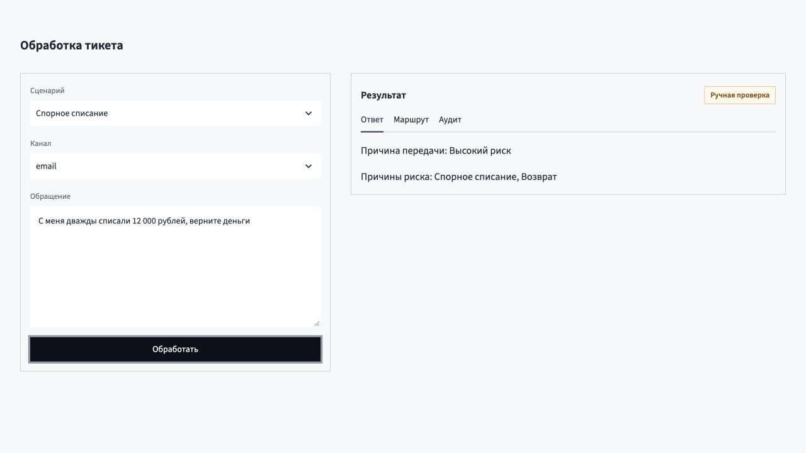
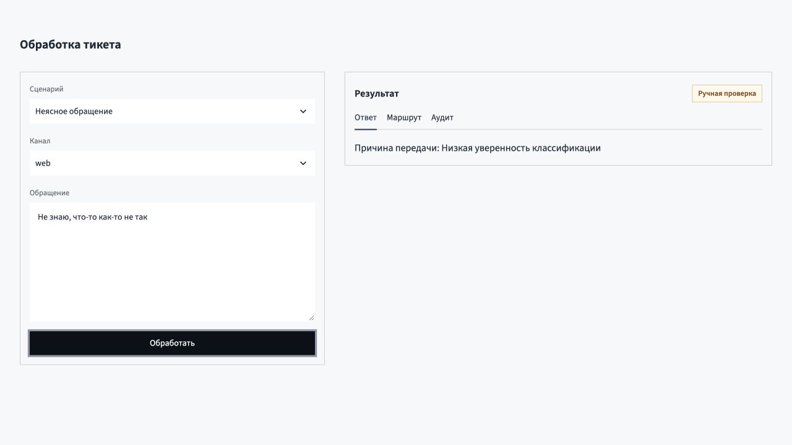

# Автоматизация обработки обращений поддержки

[Открыть рабочее демо](https://ai-support-platform-itmo-2026.streamlit.app/)

Рабочий MVP показывает один тикет от ввода до проверяемого решения. Сначала локальные правила исключают рискованные обращения и очищают персональные данные. Затем TF-IDF и Logistic Regression определяют тему, отдельный индекс ищет статью базы знаний, а DeepSeek V4 Pro через OpenRouter готовит черновик оператору. Модель не получает инструментов и не может отправить ответ или изменить учетную запись.

Оператор получает готовый маршрут, подходящую статью и редактируемый черновик вместо ручного поиска. Пользователь быстрее попадает к нужной команде, а рискованное обращение гарантированно остается у специалиста. Для бизнеса система сокращает время обработки типовых тикетов и стоимость поддержки, не превращая долю автоматизации в самоцель.

Проект решает одновременно продуктовую и техническую часть задания. [Продуктовое решение](docs/product.md) описывает первые сценарии, метрики и экономику. [Архитектура](docs/architecture.md), [модели](docs/ml.md), [наблюдаемость](docs/monitoring.md) и [надежность](docs/risks-and-ops.md) задают путь от прототипа к промышленной системе.

## Что можно проверить

В интерфейсе есть три готовых сценария:

| Обращение | Ожидаемое решение |
| --- | --- |
| «Как изменить язык приложения?» | тема `settings`, статья `KB-SET-001`, вызов OpenRouter, черновик оператору |
| «С меня дважды списали 12 000 рублей, верните деньги» | высокий риск, платежная проверка, без вызова LLM |
| «Не знаю, что-то как-то не так» | отказ из-за низкой уверенности, без вызова LLM |





## Локальный запуск

Нужны `uv` и Python 3.12. Ключ OpenRouter хранится только в локальном `.env`:

```bash
cp .env.example .env
uv sync
uv run ruff check .
uv run pytest
uv run streamlit run app.py
```

Проверка реального вызова модели:

```bash
RUN_LIVE_LLM=1 uv run pytest tests/test_live_llm.py
```

## Границы MVP

В MVP генерация выполняется синхронно, а в целевой системе выносится в очередь. Google ADK через LiteLLM не используется: для фиксированного конвейера достаточно прямого OpenAI-совместимого клиента.

Каждое решение записывается одной строкой в `.local/audit.jsonl`. Исходный текст не сохраняется: email, телефон и возможный номер карты заменяются маркерами. Журнал содержит версии компонентов, причины отказа, задержки, модель, токены и стоимость, если провайдер вернул `usage.cost`.

Дополнительные материалы: [использование ИИ](docs/AI_USAGE.md), [рабочий журнал](docs/WORKLOG.md) и [самооценка](docs/SELF_REVIEW.md).
