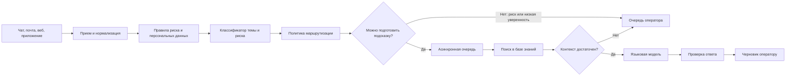
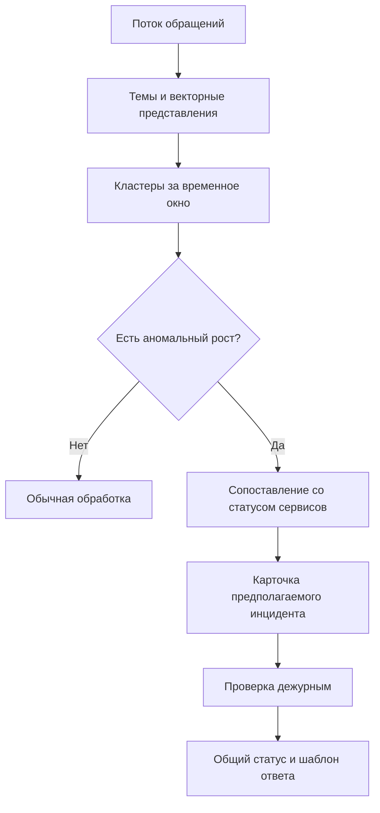

# Как устроена система

Продуктовый план задает две границы. Маршрут должен появиться не позднее чем через 500 мс, а ответ языковой модели не должен уходить пользователю без проверки. Из этих ограничений получается схема с двумя путями: быстрым разбором обращения и отдельной подготовкой черновика.

В реализованном MVP оба пути последовательно выполняются внутри одного процесса Streamlit. Это сознательное упрощение демонстрации: оно позволяет увидеть решение и задержки без брокера сообщений. Схема ниже описывает целевое разделение. В промышленной версии граница очереди обязательна, чтобы задержка и отказ внешней модели не влияли на прием обращений.

Система не заменяет платформу поддержки и не становится источником истины для статусов обращений. Она получает нормализованное обращение, оценивает тему и риск, предлагает маршрут и при подходящих условиях готовит черновик ответа. Штатная платформа продолжает отвечать за очередь, права операторов, отправку сообщений и изменение состояния тикета.

Такое разделение упрощает запуск и откат. Если новый контур недоступен, поддержка возвращается к прежнему процессу. Если языковая модель недоступна, перестает работать только подготовка черновика. Прием и ручная обработка обращений продолжаются.

## От обращения к черновику

Маршрут нужен сразу, а генерация может занять несколько секунд и зависит от внешнего сервиса. Поэтому выбор очереди и подготовка ответа работают независимо друг от друга.

## Первые 500 миллисекунд

Быстрый путь должен укладываться в 500 мс после прогрева модели. Он состоит из операций с ограниченным временем выполнения:

1. Приведение обращений из разных каналов к общей схеме.
2. Проверка явных признаков риска и персональных данных.
3. Определение темы, риска и уверенности локальной моделью.
4. Применение правил маршрутизации.
5. Запись решения и постановка безопасного обращения в очередь подготовки черновика.

Внешний вызов языковой модели в этот путь не входит. При среднем потоке около 2,3 обращения в секунду и пике примерно 33 обращения в секунду локальный классификатор не требует сложной распределенной схемы. Главный риск всплеска находится дальше: тысячи одновременных генераций увеличат стоимость, заполнят очереди и не помогут поддержке понять, что пользователи сообщают об одном инциденте.

Классификатор определяет, что произошло. Конфигурация маршрутизации указывает, какая команда занимается такой проблемой сегодня. При реорганизации поддержки меняется конфигурация, а модель не переобучается только из-за нового названия очереди.

## Что происходит после выбора маршрута

Безопасные обращения попадают в асинхронную очередь. Поисковый сервис находит статьи базы знаний по тексту, теме, продукту и языку. В контекст языковой модели попадают только разрешенные поля обращения и фрагменты утвержденных документов. Настройки внешнего сервиса обязательны: если адрес, модель или ключ не заданы, приложение завершает запуск с явной ошибкой. Локальной подмены генерации нет.

Модель готовит черновик и возвращает ссылки на использованные материалы. Перед показом оператору ответ проходит машинные проверки:

- найден ли хотя бы один документ с достаточной релевантностью;
- нет ли в ответе запрещенного обещания или предложения выполнить чувствительную операцию;
- присутствует ли ссылка на источник;
- соответствует ли формат ожидаемой структуре.

Проверки снижают риск, но не делают ответ истинным автоматически. На первом этапе последнее решение принимает оператор.

## Когда тысячи обращений говорят об одном сбое

У пикового потока есть отдельная ветвь. Система отслеживает рост тем, сходство обращений и сигналы от сервисов наблюдаемости. Если формируется устойчивый кластер, обращения связываются с предполагаемым инцидентом.

В Microsoft iPACK связанные обращения сопоставлялись с эксплуатационными событиями, поскольку одной похожести текстов оказалось недостаточно. Пользователи могут по-разному описать один сбой, а похожие сообщения могут относиться к разным причинам. Поэтому текстовый кластер дополняется телеметрией сервиса и сведениями об известных инцидентах. В прототипе потоковая кластеризация не реализована. Она не требуется для проверки одного обращения и без реального потока создала бы только инфраструктурную имитацию.

Во время подтвержденного инцидента система не запускает независимую генерацию для каждого обращения. Она использует утвержденный статус и шаблон, а обращения связывает с общей карточкой. Это одновременно уменьшает очередь, задержку и расход на модель.

## Где хранятся данные

Целевая схема использует несколько хранилищ по назначению:

| Данные | Хранилище | Причина выбора |
| --- | --- | --- |
| Нормализованные обращения и решения | PostgreSQL с разбиением по времени | связи, выборки для аудита и понятная модель данных |
| Неизменяемые выгрузки журнала | объектное хранилище | длительное хранение и расследование спорных случаев |
| Очередь генерации | Kafka-совместимая очередь | сглаживание всплесков и повторная обработка |
| Документы и векторный индекс | PostgreSQL с pgvector на первом этапе | один простой контур до доказанного роста нагрузки |
| Кэш инцидентов и ограничений | Redis | короткоживущие ключи, счетчики и защита от повторов |

Разделять текстовый поиск и векторный индекс между Elasticsearch и Qdrant стоит только после измерения ограничений pgvector. В системе МТС такое разделение дало независимое управление индексами и одновременно увеличило объем эксплуатации. Для первого запуска эта сложность не нужна.

Исходный текст и вложения хранятся в системе поддержки в соответствии с ее правилами доступа и срока хранения. В журнале решений используется очищенное представление. Секреты, полные платежные данные и документы пользователя не передаются во внешний сервис генерации.

## Где решение остается за человеком

Человек включается в четырех местах:

1. Оператор принимает, правит или отклоняет черновик.
2. Специалист поддержки разбирает обращения с низкой уверенностью и неизвестные темы.
3. Владелец базы знаний утверждает документы и сроки их действия.
4. Дежурный подтверждает массовый инцидент и общий ответ пользователям.

Возврат денег, блокировка учетной записи, изменение персональных данных и другие чувствительные действия не выполняются генеративной моделью. Их проводят сотрудники или штатные автоматические процессы с отдельными правами и проверками.

## Что происходит при сбое

| Сбой | Поведение системы |
| --- | --- |
| Недоступна языковая модель | тикет остается в очереди оператора, причина записывается в журнал |
| Недоступен поиск | черновик не создается, ответ без источника запрещен |
| Недоступен классификатор | используется заранее заданная общая очередь |
| Переполнена очередь генерации | приоритет отдается SLA и безопасным категориям, остальные тикеты обслуживаются вручную |
| Ошибка или неизвестная тема | решение модели отклоняется, пример попадает в выборку для разбора |

У системы нет режима, в котором недоступность модели блокирует прием обращений. При сбое уменьшается уровень автоматизации, а не доступность поддержки.

## Почему быстрый путь остается простым

Маршрутизация является устойчивой задачей классификации с известными классами и большим числом исторических примеров. Локальная модель дешевле, быстрее и воспроизводимее внешней языковой модели. Ее можно откалибровать, измерить на данных следующего периода и явно ограничить по классам.

Несколько агентов нужны в Microsoft TRIANGLE, потому что облачный инцидент проходит между командами, каждая команда имеет свои знания и инструменты, а системе приходится собирать новые сведения в несколько шагов. В обычном обращении такой неопределенной последовательности нет. Добавление агентов увеличит число вызовов, задержку и сложность разбора ошибок, не создав дополнительной ценности.

Агентный механизм может появиться внутри отдельного контура расследования. Он не меняет основной маршрут обращения и запускается после передачи сложного случая специалисту.

Google ADK через LiteLLM рассматривался как способ подключить OpenRouter. Этот вариант дает готовые сущности агента, инструменты, состояние и циклы выполнения. В MVP ни одной из этих возможностей нет: правила, классификация, поиск и генерация всегда идут в одном порядке. Прямой OpenAI-совместимый клиент сохраняет эту последовательность в нескольких функциях и позволяет доказать, что внешний вызов начинается только после проверки риска и очистки данных.

Модели, данные и способ проверки этой схемы описаны в разделе [«Модели и оценка качества»](ml.md).
